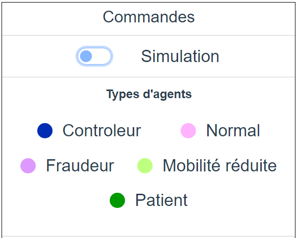
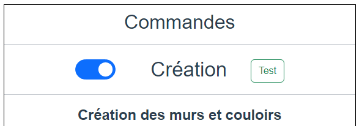
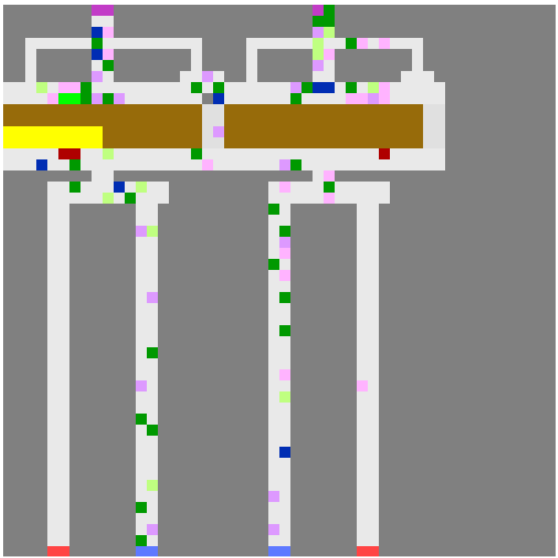

# AI30-GUI
Interface graphique de la simulation de métro.
Simple page web codé en VueJS. 
Permettant de créer des métros et lancer des simulations de traffic
de passager dessus.

Les requêtes sont faites via requête REST. Toutes les 0.5 secondes.
[Lancer la simulation](#etape-4--lancer-la-simulation)

# Navigation
- [Lancement](#lancement)
- [Tests](#test-prédéfini)
- [Creation](#pour-placer-une-case-)
- [Ponts & couloirs](#etape-1--ponts--couloirs)
- [Voies & Ponts](#etape-2--voies--ponts)
- [Portes & Sorties](#etape-3--portes--sorties)
- [Lancer la simulation](#etape-4--lancer-la-simulation)
- [Cases](#cases-de-la-carte)  
- [Paramètres](#paramétrages)
- [Liste des paramètres](#description-de-paramètres)

## Creation
En mode création, une liste de couleurs est affichée.
Ces couleurs représentent les cases que vous pouvez placer.

Ces cases doivent se mettre dans un certain ordre. Le panneau de commande vous force
donc à rentrer ces cases dans l'ordre. En ne vous affichant que les cases que vous 
pouvez ajouter à telle ou telle étape de la création.

### Pour placer une case :

1. Cliquez sur le type de case que vous voulez ajouter.
2. Cliquez sur une case de la carte à droite de la page
3. Cliquez sur une seconde case. Et le rectangle formé se remplira

**Une fois placés, pour passer à la prochaine étape cliquez sur :**

`` Valider cette étape ``

### Etape 1 : Ponts & couloirs

Les murs et les couloirs se placent en rectangles. Rien de particulier n'est à préciser

### Etape 2 : Voies & Ponts

- La simulation a besoin de 2 voies différentes. Ces voies peuvent être accolées.
- Les ponts doivent être sur les voies
- Replacer une des voies fera disparaître celle précédemment placée
- Les voies 1 & 2 se placent séparément

### Etape 3 : Portes & Sorties

L'étape 3 est la complexe.

Il faut placer au choix :
- Au moins une entrée et au moins une sortie
- Au moins une entrée/sortie
- Au moins une porte de métro sur chaque rame

Les portes de métro doivent être accolées aux rames.

Pour placer une porte de métro sur la rame 1 :
- Cliquez sur ``Portes voie 1``
- 
Pour placer une porte de métro sur la rame 2 :
- Cliquez sur ``Portes voie 1``

### Etape 4 : Lancer la simulation

Cliquez sur ``Lancer la simulation``

Ou recommencez la simulation en cliquant sur ``Recommencer``

## Paramétrages

La simulation a besoin de certains paramètres pour fonctionner. Dans le panneau de commande
avant de lancer la simulation. Vous pouvez modifier les paramètres souhaités

### Description de paramètres

| Paramètre                    | Effet                                                       |
|:-----------------------------|:------------------------------------------------------------|
| Fréquence des trains         | Interval (en secondes) entre chaque train                   |
| Temps d'arrêt                | Temps d'arrêt (en seconde) des trains                       |
| Capacité                     | Nombre d'agents pouvant rentrer dans le train               |
| Débit de création des agents | Nombre de millisecondes entre la création d'un nouvel agent |
| Controleurs                  | Présence de controleurs Oui/Non                             |
| Fraudeurs                    | Présence de Fraudeurs Oui/Non                               |
| Impolis                      | Présence d'impolis Oui/Non                                  |
| Mobilité réduite             | Présence d'usagers à mobilité réduite Oui/Non               |
| Usager patients              | Présence d'usagers patients Oui/Non                         |

## Simulation lancée
Lorsque la simulation est lancée. Le panneau de commande affichera 
un récapitulatif des agents avec les couleurs qui les représentent

*Rien n'est cliquable*

# Lancement
Pour lancer le front-end, mettez-vous dans le répertoire 
``AI30-GUI`` puis tapez la commande :

> ``npm run serve``
> 
*Vous pouvez aussi juste cliquer sur la commande écrite ci-dessus*

La page web devrait ensuite être accessible à l'adresse suivante :

[http://localhost:8080/](http://localhost:8080/)

## Test prédéfini
Une fois la page chargée. Il est possible de lancer
une carte prédéfinie. En cliquant sur le bouton
``Test``

Cette carte devrait apparaitre et lancer la simulation

## Cases de la carte
- X : Mur, zone inatteignable
- E : Entrée
- S : Sortie
- W : Entrée et Sortie
- Q : Voie
- _ : Couloir, case libre
- B: Bridge/Pont, zone accessible
- G: gate/porte de métro
- O : Porte ouverte
- M : rame de métro
- 
## Agents
- A : Agent par défaut (quand aucun autre agent n'est présent)
- C : Controleurs
- N : Agent normal
- F : Fraudeur
- P : Usager Patient
- H : Usager à mobilité réduite